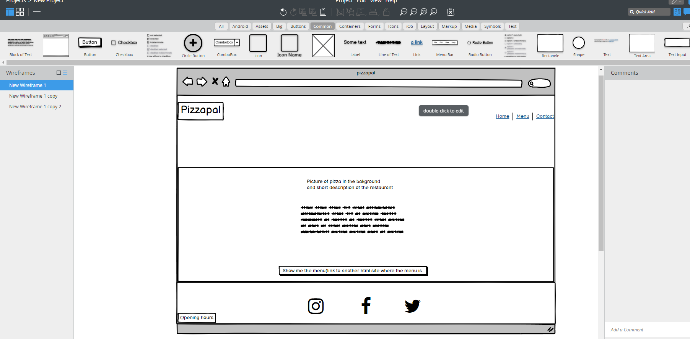
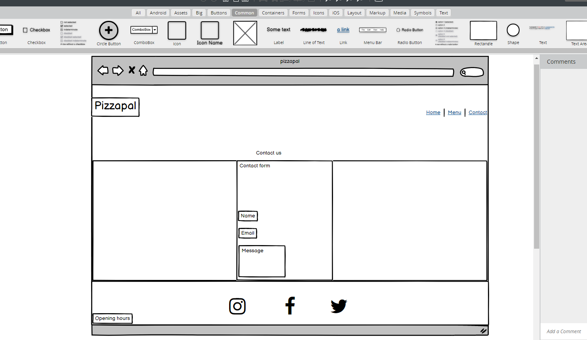

# Pizzapal
Pizzapal is a restaurant website where you will be presented with a pizza menu, then you can order either by phone or by the contactform. Pizzapal is targeting people mostly located in Sweden, Stockholm at any age. There will be a contactform where you can contact the resaturant should you have any questions.

# Features
 
 
 ## Navigation
This pictures below are prototypes, the website might look diffrent when finsihed.

1. The navigation menu will have 4 clickable links. Pizzapal, Home,Menu and Contact
2. The navigation menu will always be available, it will not disappear when you click another page on the website.
3. The navigation will clearly tell the user what page they will be on.
4. The navigation will be using font and color that contrast with the background.

## Contact us
 