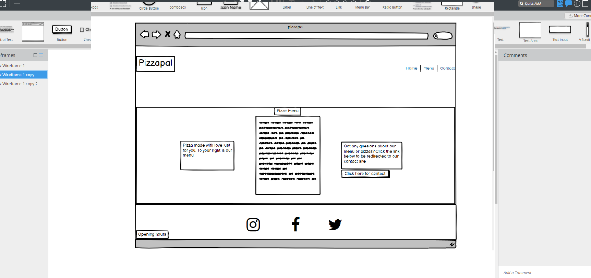

# Pizzapal
Pizzapal is a restaurant website where you will be presented with a pizza menu, then you can order either by phone or by the contactform. Pizzapal is targeting people mostly located in Sweden, Stockholm at any age. There will be a contactform where you can contact the resaturant should you have any questions. 

# Features
 
 
 ## Navigation

1. The navigation menu will have 4 clickable links. Pizzapal, Home,Menu and Contact
2. The navigation menu will always be available, it will not disappear when you click another page on the website.
3. The navigation will clearly tell the user what page they will be on.
4. The navigation will be using font and color that contrast with the background.

## Homepage
The home page will present the user with a short description of the website, it will be clear from the homepage that this is a pizza website where you can order pizza. On the bottom is three clickable icons to socialmedia. The footer and navigationbar will always be available to the user. On the topright is the navigation menu and on the left is the pizzapal header icon that is also clickable, the logo on the left will take you to the hompage. This logo will also always be available,

## Contact us page
The contact us page will have three boxes, first one is name box, second is phonenumber and last one is an email box. The boxes will be marked with a "*" for all the required boxes so that the user will know wich must be filld in order to be able to click the submit button.
 

 ## The menu page
 This page is probably the most important aspect of the page, this is where the pizza menu will be presented to the user. This page will inlclude some animation to make it appealing
 

 ## The footer
 The footer will have 3 clickable symbols to socialmedia accounts, one for "Instagram", one for "Facebook" and one for "Twitter". When the user clicks one either one then a new tap will open up and take you to the relevant page. The footer will always be visible when the user clicks on diffrent links on the navigationbar.