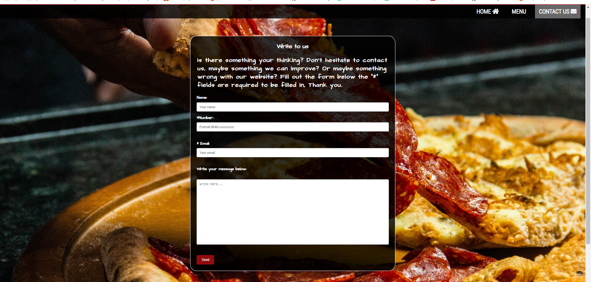
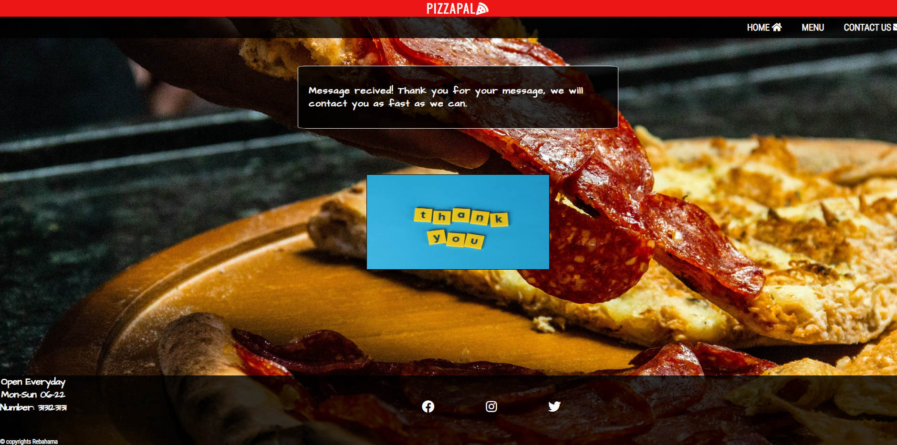

# Pizzapal
Pizzapal is a restaurant website where you will be presented with a pizza menu, then you can order either by phone or by the contactform. Pizzapal is targeting people mostly located in Sweden, Stockholm at any age. There will be a contactform where you can contact the resaturant should you have any questions. 

# Features
 
 
 ## Navigation

1. The navigation menu will have 4 clickable links. Pizzapal, Home,Menu and Contact
2. The navigation menu will always be available, it will not disappear when you click another page on the website.
3. The navigation will clearly tell the user what page they will be on.
4. The navigation will be using font and color that contrast with the background.

## Homepage
The home page will present the user with a short description of the website, it will be clear from the homepage that this is a pizza website where you can order pizza. On the bottom is three clickable icons to socialmedia. The footer and navigationbar will always be available to the user. On the topright is the navigation menu and on the left is the pizzapal header icon that is also clickable, the logo on the left will take you to the hompage. This logo will also always be available,

## Contact us page
The contact us page will have three boxes, first one is name box, second is phonenumber and last one is an email box. The boxes will be marked with a "*" for all the required boxes so that the user will know wich must be filld in order to be able to click the submit button.
 

 ## The menu page
 This page is probably the most important aspect of the page, this is where the pizza menu will be presented to the user. This page will inlclude some animation to make it appealing
 

 ## The footer
 The footer will have 3 clickable symbols to socialmedia accounts, one for "Instagram", one for "Facebook" and one for "Twitter". When the user clicks one either one then a new tap will open up and take you to the relevant page. The footer will always be visible when the user clicks on diffrent links on the navigationbar.
  

  # Finished website

  
  ## Navmenu
Here the user can choose from "home" "menu" and "contactus". The logo "pizzapal" will also be clickable and take the user back to homepage.

   

## Homepage
  The user will be seeing this on the homepage, it includes navigation menu to the right and on the bottom there is a footer with links to socialmedia. There is a bakground image of a pizza to make it very clear what the site is about. Also in the header on the top there is the logo with a pizza slice symbol to make it further clear what the site is about. On the left in the footer there is information on opening hours and copyright text. In the middle there is a link button texted:"take me to menu". To make it easier for the user to navigate directly to the menu where all the pizzas are. The button turns red when hovering with the mouse over it.

  

  ## Menu page
  This is where the most important information is displayed to the user. The user for this type of website usally have three questions, "where is the menu?" "what is the number of the restaurant?" and "are they open or closed right now"? On this page there is a menu decorated for the user to use. Next to the menu is a short text about the restaurant, on the top in the page there is a number displayed for the user so that it will be easy to choose from the menu order and call the number and still be on the same page. The footer and navbar is also visable here so all the information the user need is available.

   

## Contactus page
This page the user can send message about anything to the restaurant, it is required by the user to fill in "number" and "email" in order to send the information to the restaurant. The user is also required to type in a specific format on in the number field.

 

## Thankyou page
This page will not appear untill the user press the "send" button on the "contactus" page. This page confirms that the form has sent the message that the user wrote in the textfield. An image will appear with the text "thank you" and above it a square textfield with conformation.

 

## Footer
This is the footer where you will be presented with three diffrent symbols, each of these symbols are clickable. You will get a new tab opened when you click on the symbols. On the left bottom there is copyright text and opening hours of the restaurant. 

 

## Future ideas
In the future when the restaurant is expanding to make other dishes there should be another page called "pasta" where menu for pasta will be displayed.

## Technology
The technology used for creation of this webpage is: HTML, CSS and it was created on github.

# Testing
* I tested the website in three diffrent browsers, the first one was Google Chrome, second one was Brave browser. And the last one was Internet Edge.

* I used the site: http://ami.responsivedesign.is/ to confirm that my site is responsiv to the most common screens. The devtools in googlechrome was also used to confirm that the site is responsiv. The most common phones and tablets was used "iphone4" "iphone 12pro" "ipad mini" "Ipad air" "Samsung galaxy s8,s7" "iphone 6/7/8" "Iphone xr".

* I confirmed that the contactus-page form requires a certain type of formation to be inputed by the user.

* I have confirmed that the links in the page leads to relevant sites.

## Bugs
* Solved bugs

 In the contact-us page, on the form there is a "send" button. The color of the button behaved strange when viewed type of screens. The color value in CSS was "rgba(237,19,19,.6). I changed this color to a hex value of:#ff0000, which is a red color. The bug was fixed after this change.

 ## Validation of page
  * The index.html page showed 4 errors. On line 21 I had an </ a> tag that was empty.
  The other three warnings were the same. The warning was:"Error: Bad value _blanc for attribute target on element a: Reserved keyword blanc used." on three diffrent lines insted of "blank" i wrote "blanc" in the links in my footer.

* The menu.html page showed one error there was a closing div tag that I removed after input check.

*  The contact.html showed on line 57 that I had missed to name the "name" attribute in input.
   It also showed that I Had the tag <"legend"> inside a <""header""> element. I removed the legend inside the header and replaced it with a <"h2> tag.

* After fixing all the errors above, all the HTML files were validated once more and this time no errors appeard.

* The CSS was validated in jigsaw and no errors were shown.

* The font color and background color has good score for accesiblity, I ran the lighthouse in devtools to confirm and the picture below shows the score.

 

## Unfixed bugs

* No known bugs.

# Deployment
This site was deployed using Github. To deploy to Github pages.
* You go to the repository Project-1.
* Click on "settings" in the repository.
* Under "code and automation" there is a link called "pages", click on "pages".
* Under "source" select "branch" to "main" in the /root", click on save on the website is live.

The link to the website can be found here: [Pizzapal](https://rebahama.github.io/Project-1/).

# Credits

## Content
* Instruction on how to make the footer stuck in the bottom page was from this video: [Video](https://www.youtube.com/watch?v=yc2olxLgKLk).

* Help on how to make a form that is responsiv: [Responsiv form](https://www.w3schools.com/howto/howto_css_responsive_form.asp)

* Fonts are from Google on this page: [Fonts](https://fonts.google.com/).

* Some code in media query on how to make a responsiv navbar was taken from [Responsiv Navbar](https://www.w3schools.com/howto/howto_js_topnav_responsive.asp)

## Media
* The background picture was taken from: [Pizzapicture](https://www.pexels.com/sv-se/foto/mat-pizza-person-hand-3915857/).

* The "thankyou" picute was taken from [Thankyou](https://www.pexels.com/sv-se/foto/gul-kakel-brev-kreativitet-1887992/).

* The icons in the footer and in the navbar was taken from [Icons](https://fontawesome.com/).

